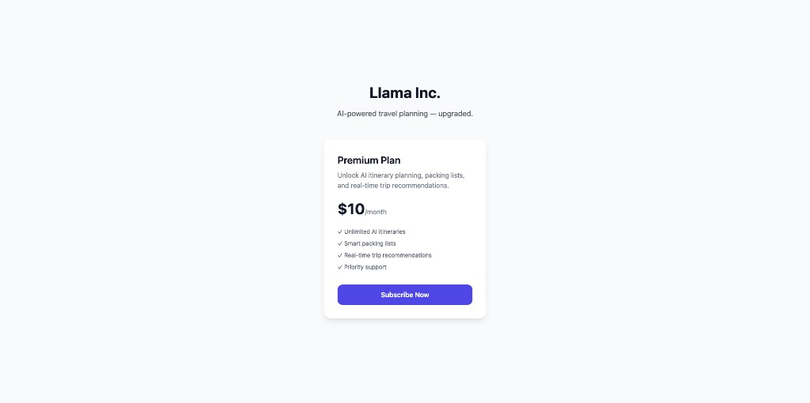
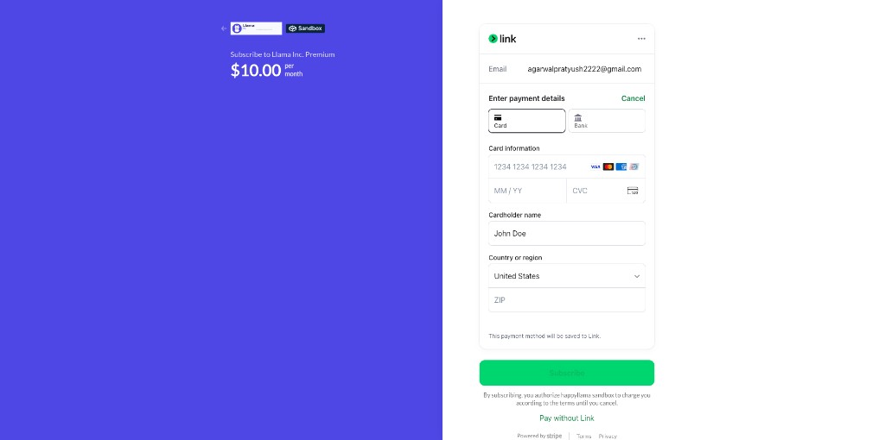
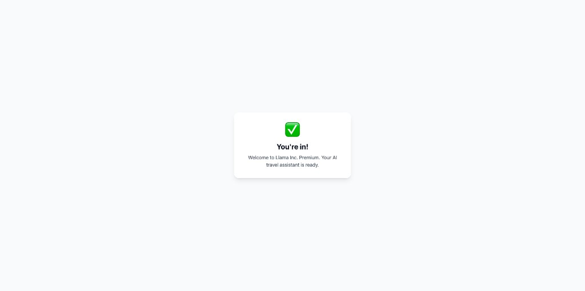
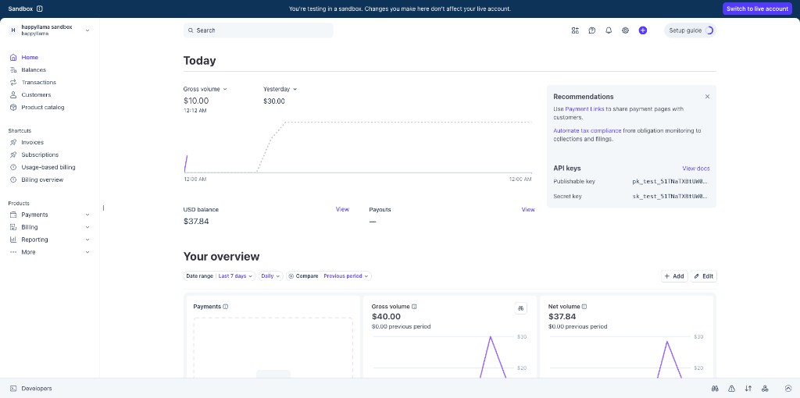
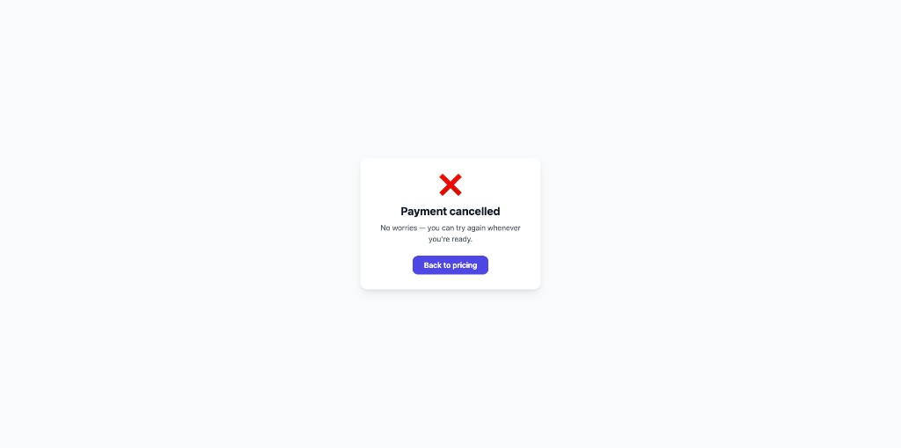
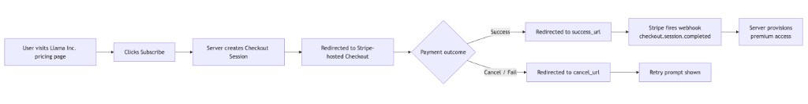

# Llama Inc. — Subscription Integration

A minimal monorepo for Llama Inc.'s Stripe Checkout
subscription integration.

## Structure
- `apps/web` — Next.js 14 frontend
- `services/api` — FastAPI backend
- `docs/` — Architecture docs and flow diagrams

## Quick Start
See `docs/APPROACH.md` for full setup instructions.

## How it looks

### Subscription page

### Payment page

### Successful payment page

### Stripe dashboard after successful payment

### Payment failure / cancel page

### Flow diagram

